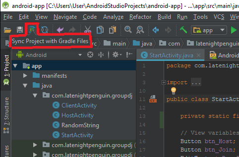

# IMPORTANT
* *As of **2018/03/21** release of the app in the master branch the app won't work properly.*
* *Message **@sivickas** on **Slack** for more details and to fix the problem.*

# Android app

Repository for android application.

IDE : Android Studio ( https://developer.android.com/studio/index.html )

If you're having troubles launching the project try :

 1. Sync the project with gradle.
    * 

## Guidelines 
* Android project and code guidelines (https://github.com/ribot/android-guidelines/blob/master/project_and_code_guidelines.md)

## Useful resources:
* Android vocabulary glossary (https://developers.google.com/android/for-all/vocab-words/?hl=en)
* Android developer tutorials, guides and documentation of various Android objects (https://developer.android.com/index.html)
* Android material design handbook (https://material.io/guidelines/material-design/introduction.html#introduction-goals)
* BitBucket markdown syntax guide (https://confluence.atlassian.com/bitbucketserver/markdown-syntax-guide-776639995.html)

